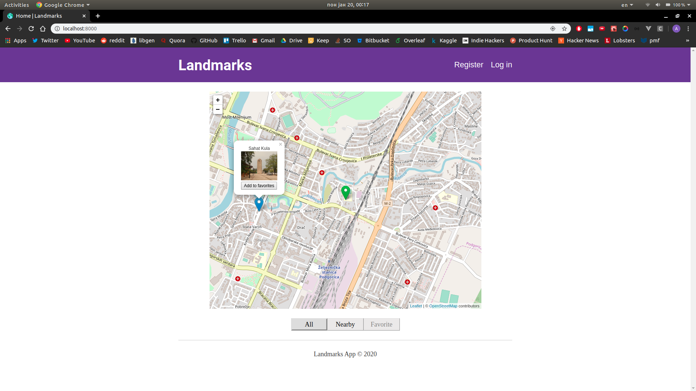

# drf-gatsby-example

Simple GIS application with Django REST Framework backend and Gatsby frontend.

## About 🤔

The application was built as a final project for Geographic Information Systems 
course at my university. Backend API was built using Django REST Framework with
PostGIS database. Frontend is made with Gatsby along with Leaflet for map 
visualization. My goal was to finish this as fast as possible, so I've made some
design decisions that I otherwise wouldn't in a production grade application 
(e.g. write all Django code in a single application). There was no need to use
Gatsby, but I wanted to try it at the time so I used it here.
 
## Preview 👀


## Setup ⚙️

To run this project you need to have Python (v3.5 or greater), Node and PostGIS
installed. Once you've done that you can proceed with the following steps.

```shell script
git clone https://github.com/AleksaC/drf-gatsby-example.git
cd drf-gatsby-example
```

### db
```shell script
sudo su postgres
psql
\i backend/sql/create_db.sql
```

### backend
```shell script
cd backend
python -m pip istall -r requirements.txt
python manage.py runserver
```

This will start a Django development server on port 3000.

### frontend
```shell script
cd ../fronted
npm install
gatsby develop
```

This will start a Gatsby development server on port 8000.

**Note**: Both Django and Gatsby development servers are configured to listen on
all interfaces by default.

### All of the above using Docker 🐋
```shell script
docker-compose up
```

Docker images were meant for development purposes and are therefore completely 
unoptimized. I used Buster images since installing GDAL for GeoDjango and sharp
for Gatsby on Alpine was pain in the ass and didn't want to waste time on it.

## Get in touch 🙋‍♂️

If you liked this project or for whatever reason want to get in touch with me
you can do so through my [personal website](https://aleksac.me), where you can
contact me directly or via social media linked there. I'm always up to something
cool/useful and if you don't want to miss out on that you should follow me on
twitter: <a target="_blank" href="http://twitter.com/aleksa_c_"></a>
